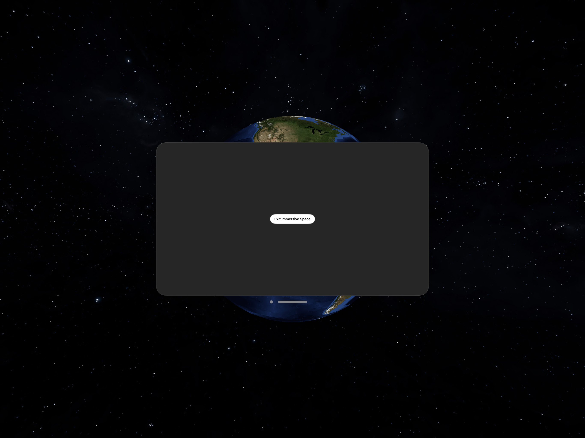

# Spatial Metal 2



Rendering two metal shaders in immersive space: Earth and Stars, which represent foreground and background. 

Fork of Spatial Metal [here](https://github.com/musesum/SpatialMetal) to add generic Uniform buffers for each eye that can be applied to multiple nodes in pipeline.
Seprated out classes into MuVision Package, shared by DeepMuse app 

Unverified on real device

Started as a port of C++ version by Warren Moore, [here](https://github.com/metal-by-example/metal-spatial-rendering)

Refactored to align with XCode Template: 
    ```
    File >> New Project >> visionOS >> App >> Window,Metal,Full
    ```
    
    
